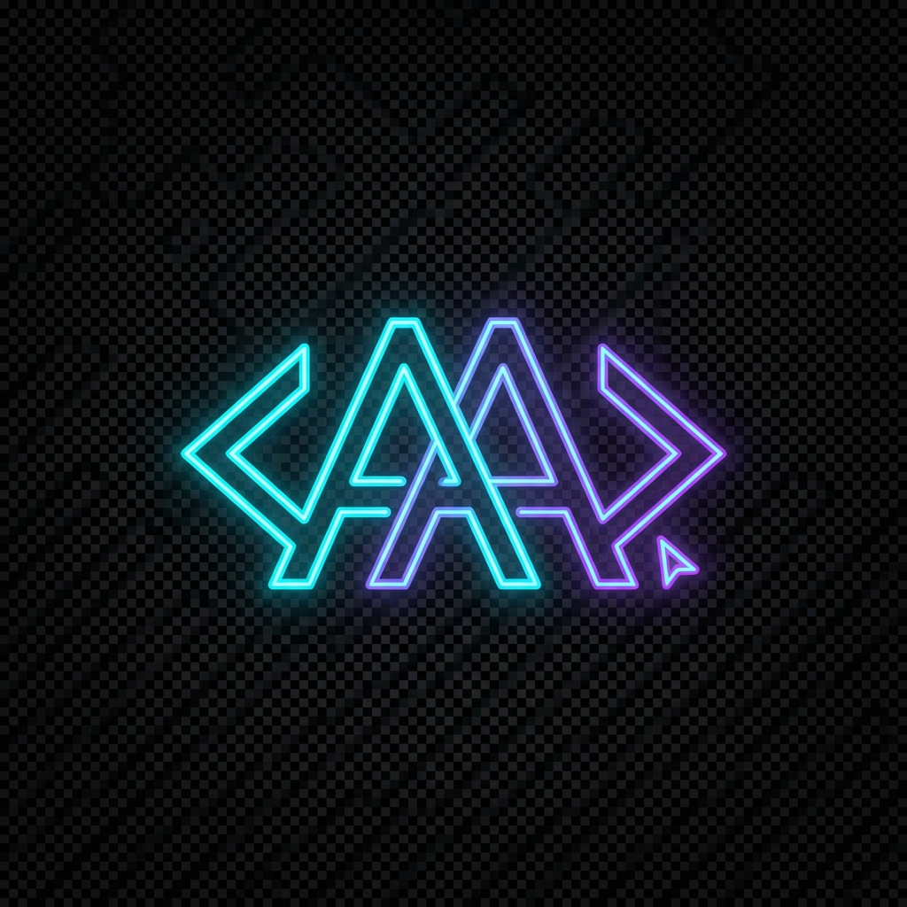

# 🌟 عبدالله عالين - معرض أعمال البرمجة (Portfolio)

<div align="center">
  
  <h3>مطور Full-Stack وشغوف ببناء تجارب رقمية استثنائية</h3>
  
  [](https://reactjs.org/)
  [](https://tailwindcss.com/)
  []()
</div>

---

## 📖 حول المشروع (About)

هذا الموقع هو معرض أعمالي الشخصي (Portfolio)، تم تصميمه وتطويره ليعكس هويتي المهنية كمطور برمجيات. يهدف الموقع إلى تقديم خدماتي ومشاريعي بطريقة احترافية، عصرية، وتفاعلية تليق بمعايير الويب الحديثة.

تم التركيز في هذا المشروع على **التجربة البصرية (Aesthetics)** و **الأداء المتفوق**، مع دمج لمسات من الذكاء الاصطناعي في عملية التطوير لضمان جودة الكود وسرعة التنفيذ.

---

## ✨ المميزات الرئيسية (Key Features)

*   **⚡ أداء صاروخي:** مبني بأحدث إصدار من React لضمان استجابة لحظية.
*   **🎨 تصميم بريميوم (Dark Mode):** واجهة مستخدم داكنة مستوحاة من أرقى التصاميم العالمية مع تأثيرات زجاجية (Glassmorphism).
*   **🖱 تفاعلية فائقة:**
    *   **Spotlight Effect:** توهج يتبع حركة الماوس لإضفاء حيوية على الصفحة.
    *   **3D Tilt:** تأثير ميلان ثلاثي الأبعاد تفاعلي لصور البروفايل وبطاقات المشاريع.
    *   **Typewriter:** عرض المهارات بتأثير الكتابة الآلية.
*   **📱 متجاوب بالكامل (Fully Responsive):** تجربة تصفح مثالية على الموبايل، التابلت، وأجهزة الحاسوب.
*   **🚀 تحريك متقدم (Advanced Animations):** استخدام حركات Reveal و Smooth Scroll لتجربة تصفح مريحة.

---

## 🛠 التقنيات المستخدمة (Tech Stack)

| التقنية | الاستخدام |
| :--- | :--- |
| **React 19** | المكتبة الأساسية لبناء الواجهات |
| **Tailwind CSS** | لتنسيق الأسلوب (Styling) وتطوير الواجهات المتجاوبة |
| **Lucide React** | لمكتبة الأيقونات العصرية |
| **Google Fonts** | استخدام خطوط IBM Plex Sans Arabic و Outfit |
| **Vite/CRA** | أدوات البناء والتطوير |

---

## 🏗 هيكلية المشروع (Architecture)

```text
src/
├── components/      # المكونات البرمجية القابلة لإعادة الاستخدام
├── assets/          # الصور والوسائط
├── App.js           # المكون الرئيسي وهيكلية الصفحة
├── index.css        # التنسيقات العامة والمتغيرات (Design System)
└── data/            # بيانات المشاريع والخدمات (لإدارة المحتوى بسهولة)
```

---

## 🚀 التشغيل المحلي (Installation)

للتعديل على المشروع أو تشغيله محلياً، اتبع الخطوات التالية:

1. **نسخ المستودع:**
   ```bash
   git clone https://github.com/abdellahialiyen0-creator/portfolio-abdullah.git
   ```

2. **تثبيت التبعيات:**
   ```bash
   npm install
   ```

3. **بدء التشغيل:**
   ```bash
   npm start
   ```

---

## 📮 تواصل معي (Contact)

أنا متاح دائماً للمشاريع الجديدة والمبتكرة.

*   **البريد الإلكتروني:** [AbdellahiAliyen0@gmail.com](mailto:AbdellahiAliyen0@gmail.com)
*   **واتساب:** [0022237783203](https://wa.me/22237783203)
*   **فيسبوك:** [عبدالله عالين](https://www.facebook.com/abdellahi.aliyon/)

---

<div align="center">
  <p>صُنع بكل شغف بواسطة <b>عبدالله عالين</b> 🇲🇷</p>
</div>
